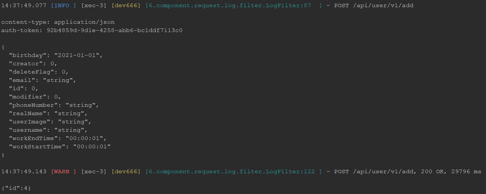

## 常用组件

### request-log-boot-starter

灵活配置，记录请求参数和响应体到日志中。

#### 配置参数

| 配置参数（前缀dev666.request.log.） | 含义                                                         | 默认值 |
| ---------------------------- | ------------------------------------------------------------ | ------ |
| enabled                      | 是否启用记录日志功能                                         | true   |
| order                        | 过滤器排序值                                                 | -10    |
| type                        | 日志使用场景。<br /><br />`DEV`：开发场景<br />`TEST`：测试场景<br />`ONLINE`：生产场景<br />`CUSTOMER`：自定义场景 | `DEV`  |
| requestLevel                 | 请求日志输出级别。默认根据日志场景决定<br /><br />`NOTHING`：什么都不输出<br />`URL`：仅输出URL<br />`URL_BODY`：输出URL和请求体<br />`URL_BODY_SOME_HEADER`：输出URL和请求体，及部分请求头<br />`ALL`：输出请求全部信息 |        |
| headers                      | 当 requestLevel 值为 `URL_BODY_SOME_HEADER` 时，设置需输出的请求头。 |        |
| responseLevel                | 响应日志级别，默认根据日志场景决定<br /><br />`NOTHING`：什么都不输出<br />`ERROR`：输出错误响应<br />`ERROR_NOBODY`：输出错误响应URL<br />`SLOW_ERROR`：输出慢响应和错误响应<br />`SLOW_ERROR_NOBODY`： 输出慢响应和错误响应URL<br />`ALL`：输出所有响应体 |        |
| requestOmitLength            | 当输出请求体时，长度超出阈值时，截取输出                     | 4KB    |
| responseOmitLength           | 当输出响应体时，长度超出阈值时，截取输出                     | 8KB    |
| slowRequestThreshold         | 慢请求阈值，请求耗时大于此值为慢请求                         | 3秒    |


#### 配置使用

1、引入依赖包

```xml

      <dependency>
            <groupId>cn.dev666.component</groupId>
            <artifactId>request-log-boot-starter</artifactId>
            <version>0.0.1</version>
        </dependency>
```

2、添加配置

```yaml
dev666:
  request:
    log:
      type: dev                 # 启用开发场景的请求日志配置
      headers:                   # 输出的请求头列表
        - Auth-Token
        - Content-Type
```

3、日志示例



### event-notice-boot-starter

灵活配置，通过事件方式，将通知消息发送到指定通道，并可自行扩展或重写。

目前支持输出到日志、邮件、钉钉、企业微信。

并可自定义通知频率，及通知合并发送。

扩展支持机器资源、JVM资源监控，异常告警。

#### 配置参数

//TODO

#### 配置使用

1、引入依赖包

```xml

      <dependency>
            <groupId>cn.dev666.component</groupId>
            <artifactId>event-notice-boot-starter</artifactId>
            <version>0.0.1</version>
        </dependency>
```

2、添加配置

```yaml
dev666:
  event:
    notice:
      enabled: true                      # 启用事件通知
      interval: 1h                       # 同一类事件不频繁时，1小时内只发送一次
      threshold: 5                       # 如果1小时内，同一类事件过于频繁，数量达到此阈值时，再次发送
      ignore-profiles: local             # 这些环境不发送
      warn-log: true                     # 通知信息输出到日志中
      ding-ding:
        enabled: true                    # 启用钉钉机器人通知   
        notice-url: https://oapi.dingtalk.com/robot/send?access_token=xxxx # 钉钉通知URL
        at-all: true                     # 启用@所有人
      os:
        enabled: true                               # 启用监控机器资源
        frequency: 1m                               # 监控频率，1分钟一次
        cpu-used-notice-rate: 0.85                  # CPU使用率达到85%时，报警
        cpu-load-average-notice-rate: 0.7           # 平均每颗CPU负载达到70%时，报警
        memory-used-notice-rate: 0.9                # 内存使用率达到90%时，报警
        disk-used-notice-rate: 0.9                  # 磁盘使用率达到90%时，报警
        file-descriptors-used-notice-rate: 0        # 不启用文件描述符报警
      jvm:
        enabled: true                               # 启用监控JVM资源
        frequency: 1m                               # 监控频率，1分钟一次
        cpu-load-notice-rate: 0.6                   # 进程CPU负载达到机器CPU总负载的60%时，次数加1
        cpu-load-notice-frequency: 3                # 进程CPU负载达到阈值的连续次数，大于等于此值时，报警
        memory-used-notice-rate: 0.9                # 有上限且非年轻代的内存区域监控，当内存使用率达到上限的90%时，次数加1
        memory-used-notice-frequency: 3             # 内存使用率达到阈值的连续次数，大于等于此值时，报警
        thread-notice-count: 2000                   # 实时线程数达到此阈值，报警
        full-gc-notice-count: 10                    # 两次监控间，出现 Full GC 次数达到此报警阈值进行报警 
```

3、日志示例

邮件通知示例


企业微信示例


钉钉示例

